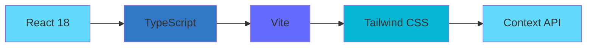

<div align="center">


# 🎨 THUMBLIFY

### AI-Powered Thumbnail Generator for Content Creators

[](https://reactjs.org/)
[](https://www.typescriptlang.org/)
[](https://nodejs.org/)
[](https://www.mongodb.com/)
[](https://ai.google.dev/)

**Transform your content creation workflow with AI-powered thumbnail generation**

[🚀 Live Demo](#) · [📖 Documentation](#) · [🐛 Report Bug](https://github.com/Riyaban583/AI-Thumbnail-Generator/issues) · [✨ Request Feature](https://github.com/Riyaban583/AI-Thumbnail-Generator/issues)

---

</div>

## 📑 Table of Contents

- [✨ Features](#-features)
- [🛠️ Tech Stack](#️-tech-stack)
- [📂 Project Structure](#-project-structure)
- [⚙️ Installation & Setup](#️-installation--setup)
- [🔐 Environment Variables](#-environment-variables)
- [▶️ Running the Application](#️-running-the-application)
- [📸 Screenshots](#-screenshots)
- [🎯 Use Cases](#-use-cases)
- [🔒 Security](#-security)
- [🤝 Contributing](#-contributing)
- [📄 License](#-license)
- [👩‍💻 Author](#-author)

---

<div align="center">

## 🌟 Overview

</div>

**THUMBLIFY** is a comprehensive, full-stack AI-powered platform designed to revolutionize content creation for digital creators. Built with modern web technologies and powered by **Google's Gemini AI**, THUMBLIFY combines intelligent thumbnail generation with a seamless user experience.

<div align="center">

### 🎯 Perfect For

| YouTubers | Content Creators | Social Media Managers | Digital Marketers |
|:---------:|:----------------:|:---------------------:|:-----------------:|
| 📺 | 🎨 | 📱 | 🎬 |
| Viral thumbnails | Rapid visual assets | Multi-platform content | Eye-catching campaigns |

</div>

---

## ✨ Features

<table>
<tr>
<td width="50%">

### 🎨 **Thumbnail Generation**

- 🧠 **AI-Powered** - Gemini AI integration
- ✍️ **Prompt-Based** - Natural language input
- 🎨 **Style Selection** - Multiple artistic styles
- 🌈 **Color Schemes** - Predefined palettes
- 📐 **Aspect Ratios** - 16:9, 4:3, 1:1, 9:16
- 👁️ **Live Preview** - Real-time visualization
- ⬇️ **HD Download** - High-quality exports
- 🔄 **Regeneration** - Unlimited attempts

</td>
<td width="50%">

### 💬 **Smart Features**

- 💬 **AI Chatbot** - Creative assistance
- 🔐 **Authentication** - Secure login/signup
- 📂 **File Upload** - Image storage (Multer)
- 📊 **History** - Track generations
- 🎯 **Templates** - Quick-start options
- ⚡ **Fast UI** - Smooth animations
- 📱 **Responsive** - Mobile-friendly
- 🌙 **Dark Mode** - Eye-friendly interface

</td>
</tr>
</table>

---

## 🛠️ Tech Stack

<div align="center">

### Frontend Architecture



</div>

<table>
<tr>
<td width="50%">

### 🎨 **Frontend Stack**

| Technology | Version | Purpose |
|------------|:-------:|---------|
| ⚛️ React.js | 18.2+ | UI Library |
| 📘 TypeScript | 5.0+ | Type Safety |
| ⚡ Vite | 5.0+ | Build Tool |
| 🎨 Tailwind CSS | 3.4+ | Styling |
| 🔄 Context API | Built-in | State Management |
| 📡 Axios | 1.6+ | HTTP Client |

</td>
<td width="50%">

### 🖥️ **Backend Stack**

| Technology | Version | Purpose |
|------------|:-------:|---------|
| 🟢 Node.js | 20.x+ | Runtime |
| 🚂 Express.js | 4.18+ | Web Framework |
| 📘 TypeScript | 5.0+ | Type Safety |
| 🍃 MongoDB | 7.0+ | Database |
| 🧠 Gemini AI | Latest | AI Generation |
| 📤 Multer | 1.4+ | File Uploads |

</td>
</tr>
</table>

---

## 📂 Project Structure

```
THUMBLIFY/
│
├── 📁 client/                          # Frontend Application
│   ├── 📁 node_modules/                # Dependencies (ignored)
│   │
│   ├── 📁 public/                      # Static Assets
│   │   ├── favicon.ico
│   │   ├── logo.png
│   │   └── manifest.json
│   │
│   ├── 📁 src/
│   │   ├── 📁 assets/                  # Images, Icons, Fonts
│   │   │
│   │   ├── 📁 components/              # Reusable Components
│   │   │   ├── AspectRatioSelector.tsx
│   │   │   ├── ChatBot.tsx
│   │   │   ├── ColorSchemeSelector.tsx
│   │   │   ├── Footer.tsx
│   │   │   ├── LenisScroll.tsx
│   │   │   ├── Login.tsx
│   │   │   ├── Navbar.tsx
│   │   │   ├── PreviewPanel.tsx
│   │   │   ├── SectionTitle.tsx
│   │   │   ├── SoftBackdrop.tsx
│   │   │   ├── StyleSelector.tsx
│   │   │   ├── TestimonialCard.tsx
│   │   │   └── TiltImage.tsx
│   │   │
│   │   ├── 📁 configs/                 # Configuration
│   │   │   └── api.ts
│   │   │
│   │   ├── 📁 context/                 # State Management
│   │   │   └── AuthContext.tsx
│   │   │
│   │   ├── 📁 data/                    # Static Data
│   │   │   ├── features.tsx
│   │   │   ├── footer.ts
│   │   │   ├── navlinks.ts
│   │   │   ├── pricing.ts
│   │   │   └── testimonial.ts
│   │   │
│   │   ├── 📁 pages/                   # Page Components
│   │   │   ├── Generate.tsx            # Generator Page
│   │   │   ├── HomePage.tsx            # Landing Page
│   │   │   ├── MyContact.tsx           # Contact Page
│   │   │   ├── MyGeneration.tsx        # History Page
│   │   │   └── YtPreview.tsx           # Preview Page
│   │   │
│   │   ├── 📁 sections/                # Page Sections
│   │   │   ├── ContactSection.tsx
│   │   │   ├── CTASection.tsx
│   │   │   ├── FeaturesSection.tsx
│   │   │   ├── HeroSection.tsx
│   │   │   ├── PricingSection.tsx
│   │   │   └── Testimonials.tsx
│   │   │
│   │   ├── 📄 App.tsx                  # Main Component
│   │   ├── 📄 globals.css              # Global Styles
│   │   ├── 📄 main.tsx                 # Entry Point
│   │   └── 📄 types.ts                 # TypeScript Types
│   │
│   ├── 📄 .eslintrc.config.js          # ESLint Config
│   ├── 📄 index.html                   # HTML Template
│   ├── 📄 package.json                 # Dependencies
│   ├── 📄 tsconfig.json                # TS Config
│   └── 📄 vite.config.ts               # Vite Config
│
├── 📁 server/                          # Backend Application
│   ├── 📁 node_modules/                # Dependencies (ignored)
│   │
│   ├── 📁 configs/                     # Configuration
│   │   ├── ai.ts                       # Gemini AI Setup
│   │   └── db.ts                       # MongoDB Connection
│   │
│   ├── 📁 controllers/                 # Business Logic
│   │   ├── AuthControllers.ts          # Auth Logic
│   │   ├── ThumbnailController.ts      # Thumbnail Logic
│   │   └── UserController.ts           # User Management
│   │
│   ├── 📁 middlewares/                 # Middleware Functions
│   │   ├── auth.ts                     # JWT Verification
│   │   └── upload.ts                   # File Upload (Multer)
│   │
│   ├── 📁 models/                      # Database Schemas
│   │   ├── Thumbnail.ts                # Thumbnail Model
│   │   └── User.ts                     # User Model
│   │
│   ├── 📁 routes/                      # API Routes
│   │   ├── AuthRoutes.ts               # Auth Endpoints
│   │   ├── ChatRoutes.ts               # Chat Endpoints
│   │   ├── ThumbnailRoutes.ts          # Thumbnail Endpoints
│   │   └── UserRoutes.ts               # User Endpoints
│   │
│   ├── 📁 uploads/                     # File Storage
│   │   └── .gitkeep
│   │
│   ├── 📄 package.json                 # Dependencies
│   ├── 📄 server.ts                    # Entry Point
│   └── 📄 tsconfig.json                # TS Config
│
├── 📄 .gitignore                       # Git Ignore
├── 📄 LICENSE                          # MIT License
└── 📄 README.md                        # Documentation

```

<div align="center">

### 📋 Directory Breakdown

</div>

<table>
<tr>
<td width="50%">

#### 🎨 **Client Directories**

| Directory | Description |
|-----------|-------------|
| `components/` | Reusable UI components |
| `pages/` | Full page components |
| `sections/` | Page sections (Hero, Features) |
| `context/` | Global state management |
| `configs/` | API configuration |
| `data/` | Static data files |

</td>
<td width="50%">

#### 🖥️ **Server Directories**

| Directory | Description |
|-----------|-------------|
| `configs/` | AI & DB configuration |
| `controllers/` | Route handlers |
| `middlewares/` | Auth & upload logic |
| `models/` | Mongoose schemas |
| `routes/` | API endpoints |
| `uploads/` | Temporary file storage |

</td>
</tr>
</table>

---

## ⚙️ Installation & Setup

### 📋 Prerequisites

Before you begin, ensure you have the following installed:

<div align="center">

| Tool | Version | Download |
|:----:|:-------:|:--------:|
| Node.js | 20.x+ | [Download](https://nodejs.org/) |
| npm | 10.x+ | Included with Node |
| Git | 2.x+ | [Download](https://git-scm.com/) |
| MongoDB | 7.x+ | [Download](https://www.mongodb.com/) |

</div>


## 📸 Screenshots

<div align="center">

### 🏠 Landing Page


### 🎨 Thumbnail Generator


### 💬 AI Chatbot Assistant


### 📊 Generation History


<table>
<tr>
<td align="center" width="33%">

### 📱 Mobile View


</td>
<td align="center" width="33%">

### 🎨 Style Selection


</td>
<td align="center" width="33%">

### 👁️ Live Preview


</td>
</tr>
</table>

</div>

---

## 🎯 Use Cases

<div align="center">

<table>
<tr>
<td width="25%" align="center">

### 📺 YouTubers


Create viral-worthy thumbnails in minutes

**Benefits:**
- ⚡ 10x faster than manual design
- 🎨 Professional quality
- 📈 Higher CTR

</td>
<td width="25%" align="center">

### 🎨 Content Creators


Rapid visual asset generation

**Benefits:**
- 🔄 Unlimited variations
- 💡 AI-powered ideas
- ⏱️ Save 5+ hours/week

</td>
<td width="25%" align="center">

### 📱 Social Media


Multi-platform content

**Benefits:**
- 📐 All aspect ratios
- 🎯 Platform-optimized
- 🔁 Consistent branding

</td>
<td width="25%" align="center">

### 🎬 Marketers


Eye-catching campaigns

**Benefits:**
- 📊 A/B testing ready
- 🎨 Brand customization
- 💼 Professional results

</td>
</tr>
</table>

</div>

### 💼 Real-World Scenarios

<details>
<summary><b>📺 YouTube Content Creator Workflow</b></summary>

**Problem:** Need thumbnail for new tech review video

**Solution:**
1. Enter video topic: "iPhone 15 Pro Max Review"
2. Select "Tech" style + "Bold" colors
3. Choose 16:9 YouTube ratio
4. Generate 5 variations
5. Download best option
6. Ask chatbot for title suggestions

**Result:** Professional thumbnail in 3 minutes vs 30+ minutes manual design

</details>

<details>
<summary><b>📱 Social Media Manager Workflow</b></summary>

**Challenge:** Create content for Instagram, YouTube, Pinterest

**Solution:**
1. Generate base thumbnail with prompt
2. Export in 1:1 for Instagram
3. Export in 16:9 for YouTube
4. Export in 9:16 for Pinterest Stories
5. Maintain consistent branding

**Result:** One design, multiple platforms, cohesive brand

</details>

---

## 🔒 Security

<div align="center">

### 🛡️ Security Features

</div>

<table>
<tr>
<td width="33%" align="center">

#### 🔐 Authentication

- JWT token-based auth
- Bcrypt password hashing
- Secure session management
- HTTP-only cookies

</td>
<td width="33%" align="center">

#### 🔒 Data Protection

- Environment variable encryption
- API key protection
- CORS configuration
- Input validation

</td>
<td width="33%" align="center">

#### 🚫 Attack Prevention

- Rate limiting
- SQL injection protection
- XSS prevention
- CSRF protection

</td>
</tr>
</table>

### ⚠️ Security Best Practices

```bash
# ✅ DO
- Use strong JWT secrets (32+ characters)
- Keep .env files out of version control
- Validate all user inputs
- Use HTTPS in production
- Regularly update dependencies

---

### 🎯 Areas We Need Help

<div align="center">

| Area | Description | Difficulty |
|:----:|:------------|:----------:|
| 🐛 | Bug Fixes | 🟢 Easy |
| 📝 | Documentation | 🟢 Easy |
| ♿ | Accessibility | 🟡 Medium |
| 🎨 | UI/UX Design | 🟡 Medium |
| ⚡ | Performance | 🔴 Hard |
| 🧪 | Testing | 🟡 Medium |

</div>

---


### Riya Bansal

[](https://github.com/Riyaban583)
[](https://linkedin.com/in/your-profile)
[](https://your-portfolio.com)
[](mailto:your.email@example.com)

</div>

---

<div align="center">

### 🙏 Acknowledgments

- Google Gemini AI for powerful AI capabilities
- React & Node.js communities
- All contributors and supporters
- Open source community

---


**Star ⭐ this repository if you found it helpful!**

[Back to Top ↑](#-thumblify)

</div>
